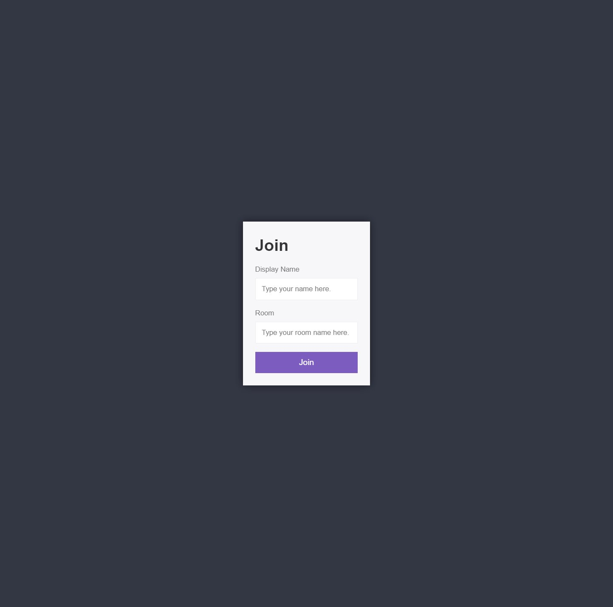
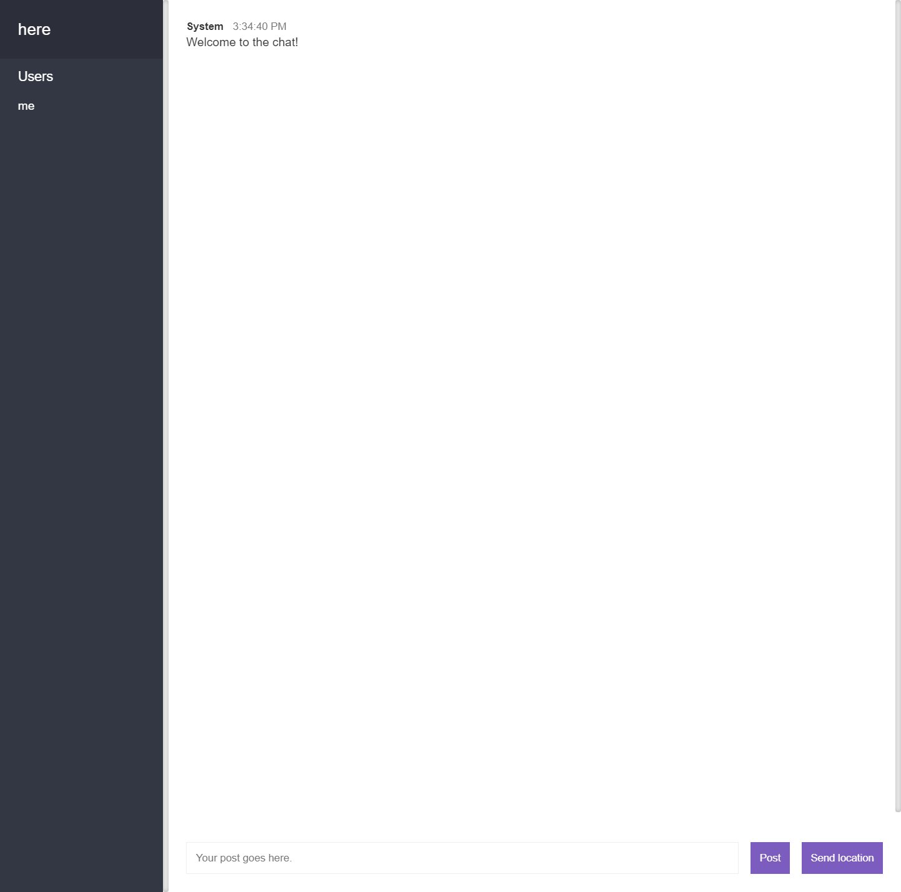
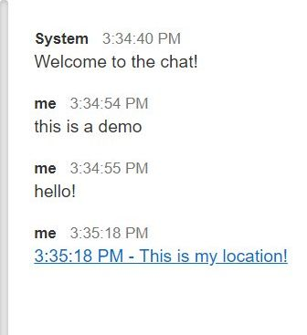

# wills-chat-app
A Node.js based fullstack application that uses socket-io/websockets in order to relay chat messages to individual sockets based on what room they are in. Made with guidance from Andrew Mead's "The Complete Node.js Developer Course". Excellent course, would recommend.

https://wills-nodejs-chat-app.herokuapp.com/

## HOW DOES IT WORK?
This app uses 2 main components. Node.js and Socket-io. Node.js is being use to create the server to allow people to connect to the application. The Socket-io npm package is being used to create and emit events between the server and the client while also handeling things like rooms and id's for individual sockets. There are also some front end libraries for generating templates (mustache.js), creating readable timestamps (moment.js) and parsing query strings (qs.js).

When a person joins the server they are greeted with a submission form for inputting things like a username and room name. Both are required to continue. In the chat room user interface theres a list of current users on the left side and a chatbox on the right. At the bottom theres a button for sending a message as well as sending a location. The location button uses the built in Geolocation API.

## SCREENSHOTS

